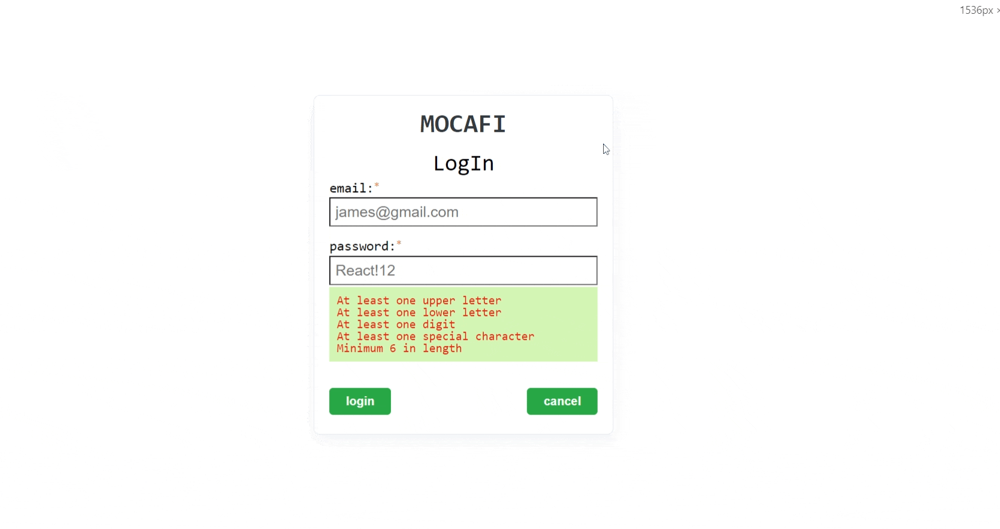

# Mocafi React App(Typescript)

This is the NEAR token explorer written by `smart-dev30`.
All the UI components and containers are written by [styled-components](https://styled-components.com/) and includes generic [eslint](https://eslint.org/) and [prettier](https://prettier.io/) configurations.

This project was bootstrapped with [Create React App](https://github.com/facebook/create-react-app).

## Setup
  > yarn install

## Screenshot


## Available Scripts

In the project directory, you can run:

### `yarn start`

Runs the app in the development mode.\
Open [http://localhost:3000](http://localhost:3000) to view it in the browser.

The page will reload if you make edits.\
You will also see any lint errors in the console.

Runs all the test cases in the development mode.\
You can see all the test case result.
### `yarn build`

Builds the app for production to the `build` folder.\
It correctly bundles React in production mode and optimizes the build for the best performance.

The build is minified and the filenames include the hashes.\
Your app is ready to be deployed!

See the section about [deployment](https://facebook.github.io/create-react-app/docs/deployment) for more information.

## Project structure

```
figment-explorer
├── components
│   ├── CheckItem      # CheckItem Component
│   ├── Button         # Button Component
│   ├── Modal          # Modal component
│   ├── Text           # Text
│   ├── Input          # Input
│   └── index.ts       # export all components in `components` folder level
│
├── View               # contain all web pages
│   ├── Login          # Login page
│   └── User           # main web page
├── app.test.tsx      # Define all test cases here
└── types              # Define types and interfaces
```
## Learn More

You can learn more in the [Create React App documentation](https://facebook.github.io/create-react-app/docs/getting-started).

To learn React, check out the [React documentation](https://reactjs.org/).
